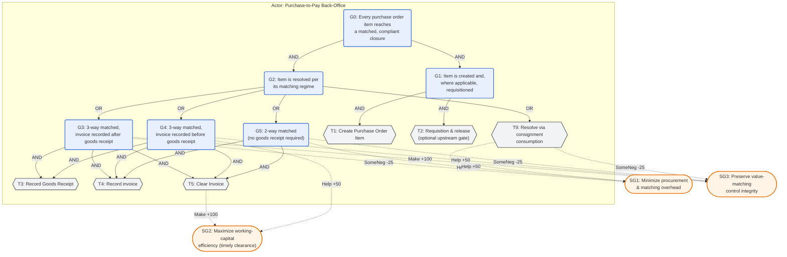

# BPIC 2019 Goal Model (Step G) — Purchase Order Handling (Procure-to-Pay)

**Status:** **Draft**, version 1.0, 2026-08-19. Authored for pipeline-development purposes, in the same
spirit as `rtfm_goal_model.md` v1.0 and `sepsis_goal_model.md` v1.0 — not yet reviewed by a procurement
or accounts-payable practitioner. §8 states exactly what is, and is not, already grounded.
**Target log:** `data/logs/bpic2019.xes.gz` — the BPI Challenge 2019 event log (van Dongen, 2019),
251,734 cases (purchase-order line items) · 1,595,923 events · 42 activity labels · 11,973 variants —
counts verified directly against the log file itself (`pm4py.read_xes`, direct scan, 2026-08-19).
**Tool-notation copy:** [`bpic2019_goal_model.jucm`](bpic2019_goal_model.jucm) — the full model
serialized as jUCMNav's native URN/GRL XMI format: §2's actor, §3–§4's goals/tasks and AND/OR
decomposition links, §5's softgoals and contribution links, and §6's five indicators (as
`grl.ecore`'s `kpimodel:Indicator`, each carrying its target/threshold/worst as a `KPIEvalValueSet`
inside an `EvaluationStrategy`, grouped under two `IndicatorGroup`s — "Time" for the three clearance
KPIs, "Quality" for the two compliance/exception KPIs), generated against the same `grl.ecore`/
`urncore.ecore`/`urn.ecore` metamodel definitions used for `rtfm_goal_model.jucm`, and checked for XML
well-formedness and referential integrity of every ID — but not round-trip verified by opening it in
jUCMNav itself (Eclipse RCP is not available in this environment). Each indicator's
`qualitativeEvaluationValue` states plainly that its target/threshold/worst are this project's own
log-computed percentiles or illustrative bounds, not organizational targets — the same distinction §6
and §8 draw in prose.
**Provenance:** The organizing axis of this model — four alternative item-resolution regimes at G2
(§3–§4) — is not this project's invention. The official BPI Challenge 2019 description states the
process comprises exactly four item categories and that "at least 4 models are needed" to describe
them (ICPM, 2019); this project's `case:Item Category` field carries those same four labels verbatim.
The actor structure, task labels, and softgoal contribution values (§2, §5) are this project's own
construction, informed by general procure-to-pay (P2P) internal-control reasoning rather than a cited
domain-expert consultation — the same gap `rtfm_goal_model.md` §8 and `sepsis_goal_model.md` §8
disclose for their own non-KPI content. §6's indicators are this project's own computation directly
against the log file (percentile latencies, compliance/exception rates), not organizational targets —
see §8 for what that distinction means for how these numbers should be read.

---

## 1. Purpose and scope

This model declares what the purchase-order handling process is *for*, independently of the log, so
that its OR-decomposition can serve as the taxonomy axis for intent-guided variant categorization
(Step 5a) — the same role `rtfm_goal_model.md` and `sepsis_goal_model.md` play for their own logs. It
covers the lifecycle of a single purchase-order line item — the log's own case granularity — from
creation through whatever value-matching and payment-clearance mechanism its item category requires,
at "a large multinational company operating from The Netherlands in the areas of coatings and paints"
(ICPM, 2019), across 60 of its subsidiaries. The log's own `case:Purch. Doc. Category name` is uniformly
"Purchase order" and its 251,734 cases resolve to 76,349 distinct purchasing documents (ICPM, 2019) —
this model, like the log, is scoped to the *item* as the unit of analysis, not the multi-item purchase
order document. It does not model control flow, timing, or exceptions beyond what a goal-task
decomposition requires — that is the job of the per-category process model discovered downstream
(Step 7), not of this artifact.

## 2. Actors

| Actor | Role | Type |
|---|---|---|
| Purchase-to-Pay (P2P) Back-Office | Creates, releases, receives, matches, and clears purchase order items, spanning the purchasing, goods-receipt, and accounts-payable functions across the company's subsidiaries | Primary |
| Requesting Business Unit | Originates the purchasing need; occasionally raises a formal Purchase Requisition ahead of the order | External |
| Vendor | Supplies the ordered goods or services; issues invoices, debit memos, and order confirmations | External |

Only the P2P Back-Office owns goals in this model; the other two are external actors it depends on or
transacts with, the same asymmetry `rtfm_goal_model.md` §2 draws for RTFM's Prefecture, Judge, and
Credit Collection Agent, and `sepsis_goal_model.md` §2 draws for Sepsis's Patient and inpatient ward.
Unlike those two models, this one does not split the internal side into further sub-actors (e.g.,
purchasing vs. accounts payable) — a simplification of real organizational structure, made for the same
reason RTFM's single back-office actor spans issuance, communication, and enforcement (§2 there).

## 3. Goal–task decomposition



**Reading the decomposition.** G0 requires both creation (G1) and resolution (G2) — an item is not
closed merely because a matching regime eventually applies to it without ever having been ordered. G2 is
OR across G3, G4, G5, and T9, reproducing the official description's four item categories one-to-one
(ICPM, 2019); this is the axis Step 5a subdivides, not one this model invents. G3 and G4 share the same
three leaf tasks (T3, T4, T5) rather than declaring separate ones, because what distinguishes them is
strictly the *relative order* in which T3 (Record Goods Receipt) and T4 (Record invoice) occur — the
same order-over-identity principle `rtfm_goal_model.md` §4 uses to justify keeping TP and TA as distinct
tasks, applied here in the opposite direction because the log's `case:GR-Based Inv. Verif.` attribute
already encodes the order distinction structurally rather than through a different activity label. G5
has no T3 child at all: direct scan confirms 0.0% of 2-way-match items ever record a Goods Receipt,
exactly matching the official description that 2-way matching checks the invoice value against the
order-creation value alone, with no separate goods-receipt message (ICPM, 2019). T9 (Consignment) is a
leaf, not a further AND-decomposition, because "no invoices exist at the PO level" for consigned stock —
consumption is settled through a mechanism outside this log (ICPM, 2019), confirmed by direct scan:
0.0% of Consignment items ever reach Clear Invoice, versus 92.9% that do record a Goods Receipt (the
physical intake is logged; the financial settlement is not).

## 4. Decomposition table

| ID | Type | Label | Operator | Children |
|---|---|---|---|---|
| G0 | Goal | Every purchase order item reaches a matched, compliant closure | AND | G1, G2 |
| G1 | Goal | Item is created and, where applicable, requisitioned | AND | T1, T2 |
| G2 | Goal | Item is resolved per its matching regime | OR | G3, G4, G5, T9 |
| G3 | Goal | 3-way matched, invoice recorded after goods receipt | AND | T3, T4, T5 |
| G4 | Goal | 3-way matched, invoice recorded before goods receipt | AND | T4, T3, T5 |
| G5 | Goal | 2-way matched (no goods receipt required) | AND | T4, T5 |
| T1 | Task | Create Purchase Order Item | leaf | — |
| T2 | Task | Requisition & release (optional upstream gate) | leaf, optional/conditional | — |
| T3 | Task | Record Goods Receipt | leaf, repeatable (multiple GR messages per item) | — |
| T4 | Task | Record invoice (vendor invoice / invoice receipt / subsequent invoice) | leaf, repeatable | — |
| T5 | Task | Clear Invoice | leaf | — |
| T9 | Task | Resolve via consignment consumption | leaf | — |

T2 collapses two genuinely optional, low-frequency sub-flows into a single leaf rather than modeling them
as separate AND children, because neither is close to mandatory: an upstream Purchase-Requisition
sub-flow (`Create Purchase Requisition Item` → `Release Purchase Requisition`) precedes order creation in
46,592 of 251,734 items (18.5%, direct scan); an explicit `Release Purchase Order` governance gate is
logged for only 961 items (0.4%). Declaring either as an AND child of G1 would misstate it as required
when the large majority of items skip it entirely — the same reasoning `sepsis_goal_model.md` §4 uses to
justify *not* declaring a "direct release without ward admission" alternative the data doesn't support,
applied here in reverse: an optional step is folded into one conditional leaf rather than split out as if
mandatory.

T3/T4/T5 recur as children of both G3 and G4 by design (§3's note above), not by omission: G4's row lists
them as "T4, T3, T5" specifically to signal the reversed order that is G4's defining feature relative to
G3, even though the decomposition operator (AND) does not itself encode sequencing.

## 5. Contribution links (softgoals)

| Source | Target | Value | Rationale |
|---|---|---|---|
| T5 (Clear Invoice) | SG2 (working-capital efficiency) | Make (+100) | Clearing is the point at which the item's cash obligation is actually settled, regardless of which matching regime produced it |
| G3 (3-way, invoice after GR) | SG3 (control integrity) | Make (+100) | Canonical sequencing — physical receipt is confirmed before the invoice is accepted for matching, the strongest of the three verified-value checks |
| G3 (3-way, invoice after GR) | SG1 (procurement overhead) | SomeNegative (-25) | An independent goods-receipt reconciliation step adds processing effort relative to a 2-way check |
| G4 (3-way, invoice before GR) | SG3 (control integrity) | Help (+50) | Still 3-way matched before clearance, but the invoice is accepted into the system ahead of physical confirmation — weaker sequencing discipline than G3 |
| G4 (3-way, invoice before GR) | SG2 (working-capital efficiency) | Help (+50) | Invoice processing can start before the goods-receipt message arrives, shortening the administrative lead time relative to G3 |
| G5 (2-way match) | SG1 (procurement overhead) | Help (+50) | No goods-receipt reconciliation step at all — the fewest checks of the three invoiced regimes |
| G5 (2-way match) | SG3 (control integrity) | SomeNegative (-25) | The invoice value is checked against the order alone, with no independent physical-receipt confirmation |
| T9 (Consignment) | SG1 (procurement overhead) | Help (+50) | No per-item invoice-clearance cycle at all — settlement happens outside this log's item-level process |
| T9 (Consignment) | SG3 (control integrity) | SomeNegative (-25) | Item-level financial visibility is lower than in the invoiced regimes, since consumption settlement is not captured here |

Qualitative scale follows the GRL/URN standard (Make = 100, Help = 50, SomePositive = 25, Unknown = 0,
SomeNegative = -25, Hurt = -50, Break = -100), as used in the IMS example (Amyot et al., 2022) and
reused by `rtfm_goal_model.md` §5 and `sepsis_goal_model.md` §5. Unlike RTFM's table, none of these
values trace to a cited internal-control standard — a targeted search for a citable source (ISO standard,
COSO framework text, or procurement textbook chapter) explicitly defining 3-way-vs-2-way matching did not
surface a directly quotable page during this model's authoring (see §8); the ordering asserted here
(3-way stronger than 2-way stronger than none) follows the general, undisputed logic of matching-based
internal control rather than a specific citation, and should be treated as this project's own qualitative
judgment pending a domain-expert or literature pass.

## 6. Indicators

| KPI | Formula | P50 | P75 | P90/P95 | Provenance |
|---|---|---|---|---|---|
| Time to invoice clearance — 3-way, invoice after GR | days, first(`Record Goods Receipt`, invoice recorded) → `Clear Invoice` | 65.2 | 84.1 | 105.5 / 119.1 | Formula grounded in the official challenge's own framing of process question 2: "the time between goods receipt, invoice receipt and payment (clear invoice)" (ICPM, 2019). Percentiles (n = 9,675 cleared items) are this project's own computation directly against the log, not an organizational target — see §8. |
| Time to invoice clearance — 3-way, invoice before GR | days, first(invoice recorded, `Record Goods Receipt`) → `Clear Invoice` | 64.4 | 87.1 | 108.1 / 117.7 | Same formula and source as above. Percentiles from n = 173,315 cleared items. |
| Time to invoice clearance — 2-way match | days, invoice recorded → `Clear Invoice` | 19.7 | 38.7 | 80.5 / 130.2 | Same formula and source as above, restricted to the invoice-only match (n = 303 cleared items — a much smaller and noisier sample than the 3-way categories, see §8). |
| 3-way matching compliance | share of 3-way-matched items cleared without ever recording a `Record Goods Receipt` | — | — | 0.31% (566 / 183,374) | Grounded in the official challenge's process question 3 on deviations and compliance (ICPM, 2019); the specific formula and the resulting rate are this project's own computation against the log, not an organizer-published figure. |
| Exception/rework rate | share of items with ≥1 of `Cancel Invoice Receipt`, `Cancel Goods Receipt`, `Block Purchase Order Item`, `Set Payment Block` | — | — | 3.39% (8,523 / 251,734) | Illustrative operational-quality indicator on SG1; no external source defines this as a formal KPI — this project's own construction, flagged as such per the same candor `rtfm_goal_model.md` §6 applies to its own third, unsourced KPI. |

The first four indicators trace their *formula* to the official challenge's own process questions
(ICPM, 2019), which is a stronger grounding than `rtfm_goal_model.md`'s third KPI has, but a weaker one
than RTFM's first two KPIs (statutory day-counts) or Sepsis's KPI1/KPI2 (physician-consulted guideline
windows, `sepsis_goal_model.md` §6): no worst/threshold/target values are published anywhere in the
public record for this log, so the P50/P75/P90/P95 columns above are this project's own descriptive
statistics, not organizational targets — a distinction that matters if these numbers are later used as
Step 8 evaluation thresholds rather than as reference points. The fifth indicator (exception rate) has no
external grounding at all, matching RTFM's own third-KPI candor.

## 7. Traceability to observed BPIC2019 activity labels (non-binding)

This table exists only to make the model legible against the actual log vocabulary; it is not part of
the goal model's authority and must not be used to pre-filter or pre-match narratives lexically — per
`project/OVERVIEW.md`, Step 6 matching is semantic ("does this narrative realize this declared
alternative?"), not a string match against this table.

| Task | Typically realized by (BPIC2019 activity labels) |
|---|---|
| T1 | `Create Purchase Order Item` |
| T2 | `Create Purchase Requisition Item`, `Release Purchase Requisition`, `Release Purchase Order`, `Change Approval for Purchase Order` |
| T3 | `Record Goods Receipt` (one or more occurrences), `Record Service Entry Sheet` (service-line equivalent) |
| T4 | `Vendor creates invoice`, `Record Invoice Receipt`, `Record Subsequent Invoice`, `Vendor creates debit memo` |
| T5 | `Clear Invoice` |
| T9 | No dedicated activity — consignment items are identified by `case:Item Category = "Consignment"`, not by a distinct task-realizing label |

Three known behaviors deliberately fall outside this table, by design rather than by omission — the same
distinction `rtfm_goal_model.md` §7 and `sepsis_goal_model.md` §7 draw for their own logs:

- **Right-censored (still-open) items** — the majority of items across all four categories have not
  reached `Clear Invoice` (or, for Consignment, were never expected to) at extraction time — e.g., only
  63.7% of "3-way, invoice after GR" and 29.0% of 2-way-match items reach clearance (direct scan). These
  represent items still open in the procurement cycle, not a violation of G0; they should be treated as
  *not yet satisfied*, not as anomalies.
- **The self-service (SRM) sub-flow** — 1,440 of 251,734 items (0.57%, direct scan) carry a family of
  `SRM: ...` status events (`SRM: Created`, `SRM: Awaiting Approval`, `SRM: Ordered`, etc.) and never
  co-occur with `Create Purchase Requisition Item` in the same item (0 overlap, direct scan) — a
  structurally distinct, low-frequency requisitioning channel this model does not decompose separately.
  It is exactly the kind of unanticipated behavior this architecture is built to surface as residual
  evidence for revising this goal model, not something this draft should be widened to absorb
  pre-emptively.
- **Non-canonical goods-receipt-after-clearance sequencing** — 566 of 183,374 cleared 3-way items
  (0.31%, §6) reach `Clear Invoice` with no `Record Goods Receipt` ever logged, contradicting both
  3-way categories' own defining requirement. This is the compliance-deviation quantity §6's third
  indicator reports, and — per the same principle as RTFM's out-of-sequence `Payment` example
  (`rtfm_goal_model.md` §7) — is retained as observable evidence, not silently excluded from the model.

## 8. Limitations of the draft artifact

**What is already grounded.** §3–§4's four-way OR decomposition at G2 reproduces the official BPI
Challenge 2019 description's own item-category structure and its explicit statement that "at least 4
models are needed" (ICPM, 2019), independently corroborated end-to-end against the log itself: every
quantitative claim in §3, §4, and §7 (the 0.0% GR rate for 2-way match, the 0.0% clearance rate for
Consignment, the 92.9% GR rate for Consignment, the 18.5%/0.4% conditional-step rates, the 0.57% SRM
rate, the 0.31% compliance-deviation rate) was computed directly against `data/logs/bpic2019.xes.gz`
during this model's authoring, not taken on faith from a secondary source. §6's four throughput/
compliance indicator *formulas* trace to the official challenge's own process questions 2 and 3 (ICPM,
2019), a stronger grounding than an invented KPI, though weaker than a domain-expert-set threshold (see
below).

**What is still open.**

- §5's contribution values assert a qualitative ordering (3-way stronger control than 2-way stronger
  than none) that reflects standard procure-to-pay internal-control reasoning, but a search for a
  specific, citable internal-control standard or textbook passage defining this ordering did not
  surface one during this model's authoring — flag any future citation of a specific ISO/COSO source
  for this claim as needing independent verification, not reuse of this document's framing.
- §6's percentile values are this project's own descriptive statistics from the log, not
  organization-published targets — unlike RTFM's statute-grounded day-counts or Sepsis's
  physician-consulted windows, there is no external source setting what a "good" clearance time should
  be for this process. The 2-way-match percentiles in particular rest on a small sample (n = 303
  cleared items out of 5,898 total 2-way-match items) and should be read with that caveat.
- The official challenge page states exactly three organizer-posed process questions (model coverage,
  invoicing throughput, and Purchasing-Document-level deviations) — an earlier working assumption during
  this model's research that the challenge published seven-to-nine numbered "compliance questions" (e.g.,
  an explicit four-eyes/segregation-of-duties rule) was not corroborated by the organizer's own page; any
  segregation-of-duties framing found elsewhere traces to individual participant submissions
  interpreting the log, not to the challenge brief itself, and should be cited as such if used.
- T9 (Consignment) has no task-realizing activity label at all in this log (§7) — its presence in the
  decomposition rests entirely on the official description's prose and the corroborating 0%-clearance/
  92.9%-GR pattern, not on a directly observable "resolution" event.
- No domain-expert (procurement or accounts-payable practitioner) review of §2–§5 has occurred, mirroring
  the open gap `rtfm_goal_model.md` §8 and `sepsis_goal_model.md` §8 disclose for their own
  non-KPI-grounded content.

This artifact should be treated as a first-pass draft, authored for pipeline-development purposes only,
in the same sense as `rtfm_goal_model.md` v1.0 and `sepsis_goal_model.md` v1.0 — a future domain-expert
pass, should one occur, supersedes this version rather than editing it in place.

## 9. References

```bibtex
@misc{vandongen2019bpic,
  author       = {van Dongen, Boudewijn F.},
  title        = {BPI Challenge 2019},
  year         = {2019},
  publisher    = {4TU.ResearchData},
  doi          = {10.4121/uuid:d06aff4b-79f0-45e6-8ec8-e19730c248f1}
}

@misc{icpm2019bpic,
  author       = {{ICPM Conference}},
  title        = {BPI Challenge 2019},
  year         = {2019},
  howpublished = {\url{https://icpmconference.org/2019/icpm-2019/contests-challenges/bpi-challenge-2019/}}
}

@techreport{gutermuth2019bpic19,
  author      = {Gutermuth, Ottmar and Lahann, Johannes and Rehse, Jana-Rebecca and Scheid, Miriam and Schuhmann, Sarah and Stephan, Sabrina and Fettke, Peter},
  title       = {Efficient and Compliant Purchase Order Handling: A Contribution to BPI Challenge 2019},
  institution = {Saarland University},
  year        = {2019},
  doi         = {10.22028/D291-34142}
}

@article{esser2021multidim,
  author  = {Esser, Stefan and Fahland, Dirk},
  title   = {Multi-Dimensional Event Data in Graph Databases},
  journal = {Journal on Data Semantics},
  volume  = {10},
  pages   = {109--141},
  year    = {2021},
  doi     = {10.1007/s13740-021-00122-1}
}

@misc{diba2019bpic19,
  author       = {Diba, Kiarash and Remy, Simon and Pufahl, Luise},
  title        = {BPI Challenge 2019: Performance and Compliance Analysis of Procurement Processes Using Process Mining},
  year         = {2019},
  howpublished = {ICPM 2019 challenge report, Hasso Plattner Institute}
}

@article{amyot2022urnsurvey,
  author  = {Amyot, Daniel and Akhigbe, Okhaide and Baslyman, Malak and Ghanavati, Sepideh and Ghasemi, Mahdi and Hassine, Jameleddine and Lessard, Lysanne and Mussbacher, Gunter and Shen, Kairui and Yu, Eric},
  title   = {Combining Goal Modelling with Business Process Modelling: Two Decades of Experience with the User Requirements Notation Standard},
  journal = {Enterprise Modelling and Information Systems Architectures (EMISAJ)},
  volume  = {17},
  number  = {2},
  pages   = {2:1--2:38},
  year    = {2022},
  doi     = {10.18417/emisa.17.2}
}
```
