# BPIC 2020 Goal Model — Travel Permit Data

**Target log:** `data/logs/bpic2020_permit.xes.gz` — the BPI Challenge 2020 Travel Permit Data event
log (van Dongen, 2020): 7,065 travel permits · 86,581 events · 51 activity labels · 1,478 variants
(counts verified with `pm4py.read_xes`). One of five correlated BPIC 2020 sub-logs; the only one
staged in this project. A case here is a travel *permit*; domestic trips do not require one, so
domestic travel (covered by the separate Domestic Declarations sub-log) is by construction absent.

**Tool-notation copy:** [`bpic2020_goal_model.jucm`](bpic2020_goal_model.jucm) — the model in jUCMNav's
URN/GRL XMI format: the actor, the goal/task decomposition, the softgoal contribution links, and §6's
three indicators (each a `grl.kpimodel:Indicator` with a `KPIEvalValueSet` conversion, a `goalcat:*`
measurement binding, and a contribution link to a softgoal). Checked for XML well-formedness and
referential integrity; not round-trip verified in jUCMNav (Eclipse RCP unavailable here). TAppr's
internal approval-chain steps are *not* further decomposed into separate task nodes — §8 explains why.

**What is grounded, and what is not.** The approval-chain structure (§3–§4) follows the official BPI
Challenge 2020 process description (ICPM, 2020), corroborated by Klein et al. (2020), who built and
validated a reference BPMN model against that same text. It names TU Eindhoven (TU/e) as the source
organization and describes the routing order (Administration → Budget Owner → Supervisor, optional
Director) and the domestic/international permit distinction. The same source flags a gap this model
inherits: **PRE_APPROVER's role and trigger are not documented anywhere in the official narrative**
(Klein et al., 2020, §12), yet `PRE_APPROVER` appears in 627 of 7,065 cases. Every quantitative claim
in §3–§4, §6, and §7 was computed directly against the log. §6's throughput-KPI value set is anchored
to EU/Dutch public-sector payment norms; the overspend and rejection rates and the softgoal
contribution values (§5) are this project's construction. No TU/e travel- or finance-administration
practitioner has reviewed §2–§5.

---

## 1. Purpose and scope

This model declares what the travel-permit authorization and cost-settlement process is *for*,
independently of the log, so its OR-decomposition can serve as the taxonomy axis for intent-guided
variant categorization (Step 5a). It covers the lifecycle of a single travel permit at TU/e (ICPM,
2020; Klein et al., 2020): submission, routing through an approval chain, the trip, and the
declarations and/or requests for payment through which the trip's costs are paid. It does not model
control flow, timing, or exceptions beyond what a goal-task decomposition requires.

## 2. Actors

| Actor | Role | Type |
|---|---|---|
| Travel & Finance Administration (TU/e) | Receives, routes for approval, tracks, and pays travel permits and the declarations/payment requests arising from them | Primary |
| Employee | Submits the permit, undertakes the trip, files the declarations and/or requests for payment | External |
| Supervisor | Line-manager approver; issues the chain's final approval unless a Director step applies; merges with the Budget Owner step when one person holds both roles | External |
| Budget Owner | Approves against the relevant project or cost-center budget | External |
| Pre-Approver | An approval role present in the log (`org:role = PRE_APPROVER`, 627 of 7,065 cases); its trigger is undocumented in any source found (§8) | External |
| Director | Final approver for a minority of permits (676 of 6,960 approved permits) | External |

Only the Travel & Finance Administration owns goals — the ADMINISTRATION role in the log's own
`org:role` field. Employee and the approval-chain roles are external actors it routes work through.

## 3. Goal–task decomposition

```mermaid
flowchart TD
    subgraph ACTOR["Actor: Travel &amp; Finance Administration"]
        G0("G0: Every submitted permit reaches a<br/>documented authorization outcome, and every<br/>cost from an approved trip is paid")
        G1("G1: Permit is submitted<br/>for authorization")
        G2("G2: Permit reaches a<br/>closed resolution")
        G3("G3: Permit is approved and its<br/>trip/costs are settled")
        G4("G4: Trip is undertaken and<br/>its costs are settled")
        G5("G5: Costs arising from the trip<br/>are declared or requested, and paid")
        T1{{"T1: Permit SUBMITTED<br/>by EMPLOYEE"}}
        TR{{"TR: Permit is rejected<br/>and not further pursued"}}
        TAppr{{"TAppr: Permit is approved<br/>through the required chain"}}
        TTrip{{"TTrip: Start trip &#8594; End trip"}}
        TDecl{{"TDecl: Declaration submitted,<br/>approved, and paid"}}
        TRFP{{"TRFP: Request For Payment<br/>submitted, approved, and paid"}}
    end
    SG1(["SG1: Minimize approval-chain<br/>overhead"])
    SG2(["SG2: Maintain budgetary<br/>control"])
    SG3(["SG3: Minimize employee<br/>reimbursement delay"])

    G0 -->|AND| G1
    G0 -->|AND| G2
    G1 -->|AND| T1
    G2 -->|OR| TR
    G2 -->|OR| G3
    G3 -->|AND| TAppr
    G3 -->|AND| G4
    G4 -->|AND| TTrip
    G4 -->|AND| G5
    G5 -->|OR| TDecl
    G5 -->|OR| TRFP

    TAppr -.->|"SomeNeg -25"| SG1
    TAppr -.->|"Help +50"| SG2
    TR -.->|"Help +50"| SG2
    TR -.->|"SomeNeg -25"| SG1
    TDecl -.->|"Help +50"| SG3
    TRFP -.->|"Help +50"| SG3

    classDef goal fill:#e8f0fe,stroke:#3367d6,stroke-width:2px
    classDef task fill:#f1f3f4,stroke:#5f6368,stroke-width:2px
    classDef softgoal fill:#fff4e5,stroke:#e8710a,stroke-width:2px
    class G0,G1,G2,G3,G4,G5 goal
    class T1,TR,TAppr,TTrip,TDecl,TRFP task
    class SG1,SG2,SG3 softgoal
```



G0 requires both submission (G1) and a closed resolution (G2). G2 is OR, not XOR: per the official
description, a rejected request is not necessarily terminal ("either the employee resubmits the
request, or the employee also [withdraws] it", ICPM, 2020) — direct scan finds 319 of 7,065 permits
(4.5%) rejected at least once before eventually reaching `FINAL_APPROVED`, and 88 (1.2%) rejected with
no later approval. G3 → G4 → G5 cascades because an approved permit's point is the trip and cost
settlement that follow. G5 is OR and deliberately inclusive: 1,157 permits (16.4%) carry *both* a
Declaration and a Request For Payment, consistent with the description's statement that RFPs also cover
costs unrelated to a specific trip and are the reimbursement mechanism for non-TU/e employees who
cannot file a declaration (ICPM, 2020).

## 4. Decomposition table

| ID | Type | Label | Operator | Children |
|---|---|---|---|---|
| G0 | Goal | Every submitted permit reaches a documented authorization outcome, and every cost from an approved trip is paid | AND | G1, G2 |
| G1 | Goal | Permit is submitted for authorization | AND | T1 |
| G2 | Goal | Permit reaches a closed resolution | OR | TR, G3 |
| G3 | Goal | Permit is approved and its trip/costs are settled | AND | TAppr, G4 |
| G4 | Goal | Trip is undertaken and its costs are settled | AND | TTrip, G5 |
| G5 | Goal | Costs arising from the trip are declared or requested, and paid | OR | TDecl, TRFP |
| T1 | Task | Permit SUBMITTED by EMPLOYEE | leaf | — |
| TR | Task | Permit is rejected and not further pursued | leaf, repeatable | — |
| TAppr | Task | Permit is approved through the required chain (Administration → [Budget Owner] → Supervisor or Director) | AND (internal steps, not decomposed — §8) | — |
| TTrip | Task | Start trip → End trip | leaf | — |
| TDecl | Task | Declaration submitted, approved, and paid | leaf, repeatable (up to 17 per permit; present in 5,608 of 7,065 cases) | — |
| TRFP | Task | Request For Payment submitted, approved, and paid | leaf, repeatable (up to 15 per permit; present in 1,325 of 7,065 cases) | — |

The official description states the routing order (Administration, then Budget Owner, then Supervisor,
Director only "in some cases", ICPM, 2020) but not the condition under which the Director step applies,
nor anything about Pre-Approver. This model does not invent those conditions: TAppr is satisfied by
reaching `Permit FINAL_APPROVED by SUPERVISOR` (6,286 of 6,960 approved permits) or `... by DIRECTOR`
(676), without asserting why one path is taken.

## 5. Contribution links (softgoals)

| Source | Target | Value | Rationale |
|---|---|---|---|
| TAppr (approval chain) | SG1 (approval overhead) | SomeNegative (-25) | A multi-step routing chain adds processing steps relative to a single approver |
| TAppr | SG2 (budgetary control) | Help (+50) | The chain is itself the control that checks a request against budget and authority |
| TR (rejection) | SG2 (budgetary control) | Help (+50) | Rejecting a non-compliant or over-budget request is the control working as intended |
| TR | SG1 (approval overhead) | SomeNegative (-25) | A rejection-and-resubmission cycle adds steps beyond a single pass |
| TDecl (Declaration) | SG3 (reimbursement delay) | Help (+50) | Enables eventual `Payment Handled`, but does not guarantee promptness |
| TRFP (Request For Payment) | SG3 (reimbursement delay) | Help (+50) | Same relationship, for the second settlement channel |

Qualitative scale is the GRL/URN standard (Amyot et al., 2022). This table is deliberately thin: no
domain-expert or organizational source assigns contribution weights for this process, so no values are
manufactured for TTrip or for finer distinctions within TAppr.

## 6. Indicators

Three indicators in two groups (`Time`, `Control`). Each carries a `KPIEvalValueSet` (the
measurement → satisfaction conversion), a `goalcat:*` measurement binding (how Step 7b obtains the
value from the log), and a contribution link giving the converted value somewhere to propagate.

| Indicator | Binding (`goalcat:*`) | target / threshold / worst |
|---|---|---|
| id 17 — Time to reimbursement | `duration_days`, `Declaration SUBMITTED by EMPLOYEE \| Request For Payment SUBMITTED by EMPLOYEE` → `Payment Handled` (last) | 30 / 60 / 120 days |
| id 18 — Budget overspend rate | `case_fraction`, `numerator` = `attr:Overspent=true` | 0 / 15 / 40 % |
| id 19 — Approval-chain rejection rate | `case_fraction`, `among` = the two `Permit FINAL_APPROVED by ...` labels, `numerator` = `before:` any `Permit REJECTED by ...` label `>>` a `Permit FINAL_APPROVED by ...` label | 0 / 10 / 25 % |

**id 17 — provenance `external-by-analogy`.** Directive 2011/7/EU art. 4 sets 30 days as the payment
term when the debtor is a public authority (extendable to 60 only in specific cases, art. 4(4)); the
Dutch central government reports itself against the same 30-day norm, and TU/e is a publicly funded
university. `target` 30, `threshold` 60, `worst` 120 illustrative. Applied by analogy — an employee
reimbursement is not itself a commercial invoice. The measurement *frame* (throughput from submission
to payment) is the challenge's own process question (ICPM, 2020; Klein et al., 2020, Q1). Contribution:
→ SG3 (reimbursement delay), Help (+50).

**id 18 — provenance `illustrative`.** The numerator is the log's own `case:Overspent` boolean,
computed by the log's publisher — no formula invention. No public source states an acceptable overspend
*rate*; the bounds bracket the observed 26.8% (1,894 / 7,065). Contribution: → SG2 (budgetary
control), Help (+50).

**id 19 — provenance `illustrative`.** Denominator: permits that reach a final approval. Numerator:
those with a rejection before it. No external KPI target; the bounds bracket the observed 4.6%
(319 / 6,960). Contribution: → SG1 (approval overhead), Help (+50).

## 7. Traceability to observed activity labels (non-binding)

For legibility against the log vocabulary only — not part of the model's authority, and not to be used
for lexical pre-matching (Step 6 matching is semantic).

| Task | Typically realized by |
|---|---|
| T1 | `Permit SUBMITTED by EMPLOYEE` (optionally preceded by `Permit SAVED by EMPLOYEE`) |
| TR | `Permit REJECTED by ADMINISTRATION` / `BUDGET OWNER` / `SUPERVISOR` / `PRE_APPROVER` / `DIRECTOR` / `EMPLOYEE` / `MISSING` |
| TAppr | `Permit APPROVED by ...`, `Permit FOR_APPROVAL by ...`, `Permit FINAL_APPROVED by SUPERVISOR` / `DIRECTOR` |
| TTrip | `Start trip`, `End trip` |
| TDecl | `Declaration SUBMITTED / APPROVED / FINAL_APPROVED / REJECTED by ...`, `Payment Handled` |
| TRFP | `Request For Payment SUBMITTED / APPROVED / FINAL_APPROVED / REJECTED by ...`, `Request Payment`, `Payment Handled` |

Two behaviors sit outside this table by design: **`Send Reminder`** (1,381 of 7,065 cases, 19.5%) is a
system-generated nudge about an already-pending declaration or payment request, not a business step
toward G0. **`Start trip` / `End trip` occurring regardless of the permit's outcome** — both activities
are present in essentially every case (7,065 / 7,065), including permits ultimately rejected and never
resubmitted. This contradicts the description's framing that international-trip permission "should be
approved before making any arrangements" (ICPM, 2020); a plausible unverified explanation is that these
two events are derived from the permit's *planned* travel dates rather than independently timestamped.
It is retained as observable evidence rather than normalized away.

## 8. Limitations

- **Pre-Approver is an acknowledged, unresolved gap.** Klein et al. (2020, §12): "an involvement of
  this entity is never mentioned in the textual description", despite `PRE_APPROVER` in 627 of 7,065
  cases. TAppr is satisfied by reaching a final-approval activity without asserting where Pre-Approver
  sits or what triggers it — hence TAppr is a single leaf, not decomposed.
- The Budget Owner/Supervisor merge and the Director-step condition are stated only qualitatively by
  the official source ("if the budget owner and supervisor are the same person, then only one of these
  steps is taken"; the Director approves "in some cases"). No threshold rule was found.
- TTrip's placement in §3–§4 is a normative statement of intended business logic, not a description of
  what this log's `Start trip` / `End trip` events encode (§7).
- id 17's value set is `external-by-analogy`: EU/Dutch public-sector payment norms applied to an
  employee reimbursement. id 18 and id 19 bounds are `illustrative` — no external target exists.
- Challenge-question wording beyond the throughput question (id 17's frame) was not re-verified against
  the live challenge page; Klein et al. (2020) and Nikolayuk et al. (2020) are challenge technical
  reports, not confirmed peer-reviewed proceedings papers.
- No TU/e travel- or finance-administration practitioner has reviewed §2–§5.

## 9. References

```bibtex
@misc{vandongen2020bpic,
  author       = {van Dongen, Boudewijn F.},
  title        = {BPI Challenge 2020: Travel Permit Data},
  year         = {2020},
  publisher    = {4TU.ResearchData},
  doi          = {10.4121/uuid:ea03d361-a7cd-4f5e-83d8-5fbdf0362550}
}

@misc{icpm2020bpic,
  author       = {{ICPM Conference}},
  title        = {BPI Challenge 2020},
  year         = {2020},
  howpublished = {\url{https://icpmconference.org/2020/bpi-challenge/}}
}

@misc{eu2011latepayment,
  author       = {{European Union}},
  title        = {Directive 2011/7/EU on combating late payment in commercial transactions (art. 4: public authorities as debtors)},
  year         = {2011},
  howpublished = {Official Journal of the European Union L 48/1}
}

@misc{klein2020bpic20,
  author       = {Klein, Sabrina and Lahann, Johannes and Mayer, Lukas and Neu, Daniel and Pfeiffer, Philip and Rebmann, Adrian and Scheid, Miriam and Willems, Benjamin and Fettke, Peter},
  title        = {Business Process Intelligence Challenge 2020: Analysis and Evaluation of a Travel Process},
  year         = {2020},
  howpublished = {ICPM 2020 challenge report, \url{https://icpmconference.org/2020/wp-content/uploads/sites/4/2020/10/ICPM_2020_paper_99.pdf}}
}

@misc{nikolayuk2020bpic20,
  author       = {Nikolayuk, Anna and Sdvizhkova, Ekaterina and Khabarova, Yulia and Shtokolova, Anastasiia and Tarasov, Yaroslav},
  title        = {BPI Challenge 2020 Report: Analyzing International and Domestic Travel Processes},
  year         = {2020},
  howpublished = {ICPM 2020 challenge report, \url{https://icpmconference.org/2020/wp-content/uploads/sites/4/2020/10/ICPM_2020_paper_100.pdf}}
}

@article{amyot2022urnsurvey,
  author  = {Amyot, Daniel and Akhigbe, Okhaide and Baslyman, Malak and Ghanavati, Sepideh and Ghasemi, Mahdi and Hassine, Jameleddine and Lessard, Lysanne and Mussbacher, Gunter and Shen, Kairui and Yu, Eric},
  title   = {Combining Goal Modelling with Business Process Modelling: Two Decades of Experience with the User Requirements Notation Standard},
  journal = {Enterprise Modelling and Information Systems Architectures (EMISAJ)},
  volume  = {17},
  number  = {2},
  pages   = {2:1--2:38},
  year    = {2022},
  doi     = {10.18417/emisa.17.2}
}
```
