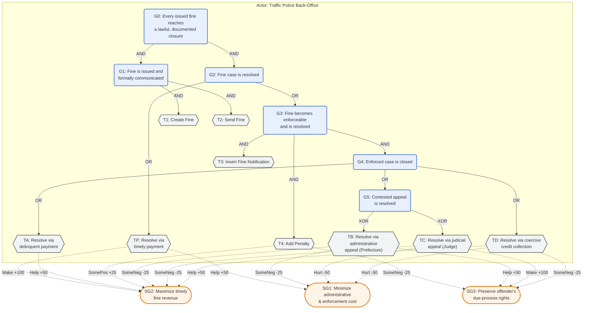

# RTFM Goal Model — Road Traffic Fine Management

**Target log:** `data/logs/rtfm.xes.gz` — the Road Traffic Fine Management Process event log
(231 variants, 150,370 cases; de Leoni & Mannhardt, 2015).

**Tool-notation copy:** [`rtfm_goal_model.jucm`](rtfm_goal_model.jucm) — the model in jUCMNav's
URN/GRL XMI format: the actor, the goal/task decomposition with AND/OR/XOR links, the softgoal
contribution links, and §6's four indicators (each a `grl.kpimodel:Indicator` with a `KPIEvalValueSet`
conversion, a `goalcat:*` measurement binding, and a contribution link to a softgoal, grouped under
one `Time` `IndicatorGroup`). Generated against the actual `grl.ecore`/`urncore.ecore`/`urn.ecore`
metamodel definitions from `JUCMNAV/jUCMNavPlus`; checked for XML well-formedness and referential
integrity; not round-trip verified in jUCMNav (Eclipse RCP unavailable here).

**What is grounded, and what is not.** §3–§4's decomposition is cross-checked against the DPN-net
process model in Mannhardt et al. (2016, §6.1.1, Fig. 7–8), which its authors designed "using a
discovered model next to domain knowledge and information regarding traffic regulations" for this exact
police force and log. The legal framing (actor roles, appeal-channel mutual exclusivity) is grounded
in the publicly documented Italian administrative-sanction procedure (Legge 689/1981; Codice della
Strada, D.Lgs. 285/1992). §6's time-KPI value sets are statutory day-counts from those laws (§6). §5's
contribution values and §6.2's indicator→softgoal weights are this project's construction. No
*Polizia Locale* administrative officer or legal counsel has reviewed §2–§5 for this municipality's
actual procedure (§8).

---

## 1. Purpose and scope

This model declares what the fine-management process is *for*, independently of the log, so its
OR-decomposition can serve as the taxonomy axis for intent-guided variant categorization (Step 5a).
It covers the lifecycle of a single road traffic fine from issuance to closure, as administered by a
local police back-office (*Polizia Locale*) under Italian law. It does not model control flow, timing,
or exceptions beyond what a goal-task decomposition requires.

## 2. Actors

| Actor | Role | Type |
|---|---|---|
| Traffic Police Back-Office (*Polizia Locale*) | Issues, communicates, enforces, and closes fine cases | Primary |
| Offender | Recipient of the fine; selects among the available resolution paths | External |
| Prefecture (*Prefetto*) | Adjudicates administrative appeals (Art. 203, D.Lgs. 285/1992) | External |
| Judge (*Giudice di Pace*) | Adjudicates judicial appeals (Art. 204-bis, D.Lgs. 285/1992) | External |
| Credit Collection Agent | Executes coercive recovery of unpaid, unresolved fines | External |

Only the Traffic Police Back-Office owns goals; the other four are external actors it depends on for
case resolution.

## 3. Goal–task decomposition



G0 requires both formal communication (G1) and resolution (G2). G2 is OR, not XOR: a case that pays
before enforcement (TP) satisfies G2 directly, but the majority enter the enforced branch G3, whose
closure (G4) is itself OR because an enforced case's history can combine tasks (e.g. an appeal
ultimately followed by payment) rather than select exactly one. The one place XOR is legally correct
is G5: by statute the administrative appeal (Prefecture) and the judicial appeal (Judge) are mutually
exclusive remedies for the same violation — electing one forecloses the other (*alternatività dei
rimedi*, L. 689/1981).

## 4. Decomposition table

| ID | Type | Label | Operator | Children |
|---|---|---|---|---|
| G0 | Goal | Every issued fine reaches a lawful, documented closure | AND | G1, G2 |
| G1 | Goal | Fine is issued and formally communicated | AND | T1, T2 |
| G2 | Goal | Fine case is resolved | OR | TP, G3 |
| G3 | Goal | Fine becomes enforceable and is resolved | AND | T3, T4, G4 |
| G4 | Goal | Enforced case is closed | OR | TA, G5, TD |
| G5 | Goal | Contested appeal is resolved | XOR | TB, TC |
| T1 | Task | Create Fine | leaf | — |
| T2 | Task | Send Fine | leaf | — |
| T3 | Task | Insert Fine Notification | leaf | — |
| T4 | Task | Add Penalty | leaf | — |
| TP | Task | Resolve via timely payment | leaf, repeatable (installments) | — |
| TA | Task | Resolve via delinquent payment | leaf, repeatable (installments) | — |
| TB | Task | Resolve via administrative appeal to the Prefecture | AND (internal steps) | file appeal, transmit to Prefecture, receive ruling, notify offender |
| TC | Task | Resolve via judicial appeal to the Judge | leaf | — |
| TD | Task | Resolve via coercive credit collection | leaf | — |

TP and TA are two distinct tasks despite both being "payment", because their business meaning differs
by *when* they occur relative to enforcement (T3/T4): a case satisfying TP never needed formal
notification or a penalty surcharge; a case satisfying TA did. This is the taxonomy axis carving on
business intent rather than activity-label identity — a distinction a purely lexical grouping would
miss. It is also a simplification: Mannhardt et al. (2016, Fig. 7) place three separate `Payment`
transitions in the DPN-net (after `Create Fine`, after `Send Fine`, after `Notification`), not a binary
timely/delinquent choice. Collapsing the first two into TP and the third into TA is deliberate; a
future revision could split TP further if the taxonomy needs it.

## 5. Contribution links (softgoals)

| Source | Target | Value | Rationale |
|---|---|---|---|
| TP | SG2 (timely revenue) | Make (+100) | Fastest possible recovery, no enforcement delay |
| TP | SG1 (low cost) | Help (+50) | No formal notification, penalty computation, or third-party involvement |
| TA | SG2 (timely revenue) | Help (+50) | Recovers revenue, but later than TP |
| T4 (Add Penalty) | SG2 (timely revenue) | SomePositive (+25) | Surcharge increases eventual recovered amount |
| T4 (Add Penalty) | SG3 (due process) | SomeNegative (-25) | Added financial burden on the offender |
| TB (Prefecture appeal) | SG3 (due process) | Help (+50) | Preserves the offender's right to administrative review |
| TB (Prefecture appeal) | SG1 (low cost) | SomeNegative (-25) | Adjudication overhead for the back-office |
| TB (Prefecture appeal) | SG2 (timely revenue) | SomeNegative (-25) | Suspends/delays recovery pending ruling |
| TC (Judicial appeal) | SG3 (due process) | Make (+100) | Strongest guarantee — independent judicial review |
| TC (Judicial appeal) | SG1 (low cost) | Hurt (-50) | Court fees and case-management overhead |
| TC (Judicial appeal) | SG2 (timely revenue) | SomeNegative (-25) | Suspends/delays recovery pending ruling |
| TD (Credit collection) | SG2 (timely revenue) | Help (+50) | Eventually recovers revenue from non-payers |
| TD (Credit collection) | SG1 (low cost) | Hurt (-50) | Collection-agent fees and enforcement overhead |
| TD (Credit collection) | SG3 (due process) | SomeNegative (-25) | Coercive path, least offender agency in the outcome |

Qualitative scale is the GRL/URN standard (Make = 100, Help = 50, SomePositive = 25, Unknown = 0,
SomeNegative = -25, Hurt = -50, Break = -100; Amyot et al., 2022).

## 6. Indicators

Four indicators in one `Time` group. Each carries a `KPIEvalValueSet` (the measurement → satisfaction
conversion), a `goalcat:*` measurement binding (§6.1), and a contribution link to a softgoal (§6.2).

| KPI | Formula (informal) | Worst | Threshold | Target | Provenance |
|---|---|---|---|---|---|
| Time to fine dispatch | days, `Create Fine` → `Send Fine` | 360 | 90 | 30 | Threshold and worst are **statutory**: Art. 201, D.Lgs. 285/1992 sets the ordinary notification term at 90 days and an extended term (illustratively, up to 360) for cases requiring foreign or complex ownership lookup; the 90-day figure is corroborated by the `Delay Send' < 90 days` guard in Mannhardt et al. (2016, Fig. 8). The target is **external, by analogy**: L. 241/1990 art. 2 c.2 sets 30 days as the default term for concluding an administrative proceeding where no specific term exists — an operational aspiration here, not a binding term. |
| Time to appeal filing, Prefecture | days, notification → `Insert Date Appeal to Prefecture` / `Send Appeal to Prefecture` | 120 | 60 | 60 | **Statutory**: Art. 203, D.Lgs. 285/1992 gives 60 days for a *ricorso al Prefetto*; corroborated by Fig. 8's `Delay Prefecture' < 60 days` guard. `target == threshold` deliberately: an admissibility window is a boundary, not a gradient. Worst (120) is illustrative, twice the window. |
| Time to appeal filing, Judge | days, notification → `Appeal to Judge` | 60 | 30 | 30 | **Statutory**: Art. 204-bis, D.Lgs. 285/1992 gives 30 days for a *ricorso al Giudice di Pace* — half the Prefecture window. Worst (60) is illustrative. |
| Average time to case closure | days, `Create Fine` → last resolving task | 365 | 180 | 150 | **External, by analogy**: L. 241/1990 art. 2 caps any administrative proceeding's term at 180 days, which supplies the threshold; the target is Art. 201's 90-day notification term plus Art. 203's 60-day payment/appeal window, i.e. the earliest lawful completion of an uncontested case. Worst (365) is illustrative. |

A citation note: §2 originally attributed Art. 203 and Art. 204-bis to L. 689/1981; both articles
belong to the Codice della Strada (D.Lgs. 285/1992). L. 689/1981 remains the correct source for the
general administrative-sanction framing and the *alternatività dei rimedi* rule in §3.

### 6.1 Measurement bindings

The log-to-indicator binding is supplied as URN `Metadata` under a `goalcat:` prefix, so it travels
inside the `.jucm` file and survives a jUCMNav round trip. `goalcat.grl.measures` documents the key
set; `goalcat.indicators` (Step 7b) consumes it. All four indicators use `goalcat:measure =
duration_days`, with `goalcat:from`/`goalcat:to` naming the clock endpoints and `goalcat:applies_when`
scoping the two appeal-filing KPIs to cases that filed the relevant appeal.

The activity labels in these bindings are a measurement device, not a matching rule — §7's prohibition
on lexical pre-matching governs Step 6 categorization, which runs before this and never sees them.

### 6.2 Contribution links

An `Indicator` is an `IntentionalElement` and sits in the satisfaction graph, but a converted value
needs a link to propagate. Four links:

| Indicator | → | Element | Contribution | Rationale |
|---|---|---|---|---|
| Time to fine dispatch | → | SG2 Maximize timely fine revenue | Help (+50) | Notification beyond the statutory term voids the fine, so dispatch timeliness is what makes the revenue collectable at all. |
| Time to appeal filing, Prefecture | → | SG3 Preserve offender's due-process rights | Help (+50) | An appeal filed inside the statutory window is an exercised right; one filed outside it is a foreclosed one. |
| Time to appeal filing, Judge | → | SG3 Preserve offender's due-process rights | Help (+50) | Same, for the judicial route. |
| Average time to case closure | → | SG2 Maximize timely fine revenue, SG1 Minimize administrative & enforcement cost | Help (+50) each | A case that stays open ties up both revenue and administrative effort. |

These weights are **authored for this artifact, not sourced** — the same illustrative status §5's
contribution table carries, and the least externally grounded part of the model.

### 6.3 What the value sets can and cannot discriminate

Measured against the real log, two of the four saturate, and that is itself the finding rather than a
defect to tune away. Over the six-case `rtfm_mini` fixture, closure times run 1, 78, 550 and 971 days
against a value set whose whole scale spans 150–365, so most cases clamp at ±100. Recalibrating
`worst` to the log's own spread would restore discrimination at the cost of making the threshold a
function of the data it scores — the circularity flagged in §8's "provenance circularity" bullet, and
the reason the BPIC 2019 clearance KPIs were re-anchored to statute rather than left as log
percentiles. The value sets stay externally anchored and the saturation is reported;
`goalcat.indicators` prints the raw measured value beside every satisfaction score for this reason.

## 7. Traceability to observed RTFM activity labels (non-binding)

For legibility against the log vocabulary only — not part of the model's authority, and not to be used
for lexical pre-matching (Step 6 matching is semantic).

| Task | Typically realized by (RTFM activity labels) |
|---|---|
| T1 | `Create Fine` |
| T2 | `Send Fine` |
| T3 | `Insert Fine Notification` |
| T4 | `Add penalty` |
| TP / TA | `Payment` (one or more occurrences) |
| TB | `Insert Date Appeal to Prefecture`, `Send Appeal to Prefecture`, `Receive Result Appeal from Prefecture`, `Notify Result Appeal to Offender` |
| TC | `Appeal to Judge` |
| TD | `Send for Credit Collection` |

Two behaviors sit outside this table by design: **right-censored (open) cases** — e.g. variants
ending at `Create Fine > Send Fine` with no resolving task — are cases still pending at extraction, not
a violation of G0; treat them as *not yet satisfied*, not anomalies. **Non-canonical orderings** —
e.g. a `Payment` before `Send Fine` (plausible as an in-person roadside payment logged out of the
mailed-notice sequence) — are the kind of behavior this architecture surfaces as residual evidence for
revising the goal model, not something this draft should absorb pre-emptively.

## 8. Limitations

- §6's "Average time to case closure" KPI has its threshold in L. 241/1990 art. 2, but its `worst`
  bound (365 days) has no external source, and neither do §6.2's contribution weights.
- §4's TP/TA split is a business-intent simplification of the DPN-net's three-point `Payment` structure
  (§4) — defensible for this goal model's purpose, but not a 1:1 mirror of the cited process model.
- **Partial provenance circularity of the taxonomy axis.** §1 designates §3–§4's OR/XOR
  decomposition as the taxonomy axis for Step 5a's intent-guided categorization, and §3–§4 is
  cross-checked against the DPN-net of Mannhardt et al. (2016), a model its authors built "using a
  discovered model next to domain knowledge and information regarding traffic regulations". The axis
  is therefore not fully independent of the RTFM log it is later used to categorize: part of its
  structure traces back to a process model discovered from that same log. This is weaker circularity
  than deriving value-set bounds from the log they score, as an earlier BPIC 2019 draft did before its
  clearance KPIs were re-anchored to statute (§6.3) — the cross-check informs the decomposition's
  shape, it does not set category boundaries from the data — but downstream comparisons against
  structural or lexical baselines should be read with the dependence in mind, not as a contrast
  between a log-blind axis and log-derived ones.
- No domain-expert review, as distinct from literature cross-checking, has occurred for §3–§6 as a
  whole. This mirrors the bottleneck the goal-oriented process mining literature reports — "logs
  typically do not include explicit goals, KPIs, or goal models" (Ghasemi et al., 2025). That
  literature closes the gap through domain-expert review: Ghasemi (2021, Ch. 8) grounded three Sepsis
  KPIs in physician consultation against guideline windows from Mannhardt & Blinde (2017), traceable to
  the Surviving Sepsis Campaign 2016 guidelines (Rhodes et al., 2017); see `sepsisGM_description.md`
  §6, which reuses those three KPIs.

`data/goals/rtfm_mini_goal_model.jucm` carries the identical model for the six-case `rtfm_mini`
fixture — see `rtfm_miniGM_description.md` for why it exists and what must stay in step.

## 9. References

```bibtex
@misc{deleoni2015rtfm,
  author       = {de Leoni, Massimiliano and Mannhardt, Felix},
  title        = {Road Traffic Fine Management Process},
  year         = {2015},
  publisher    = {4TU.ResearchData},
  doi          = {10.4121/uuid:270fd440-1057-4fb9-89a9-b699b47990f5}
}

@article{mannhardt2016balanced,
  author  = {Mannhardt, Felix and de Leoni, Massimiliano and Reijers, Hajo A. and van der Aalst, Wil M. P.},
  title   = {Balanced multi-perspective checking of process conformance},
  journal = {Computing},
  volume  = {98},
  number  = {4},
  pages   = {407--437},
  year    = {2016},
  doi     = {10.1007/s00607-015-0441-1}
}

@misc{legge689_1981,
  author       = {{Repubblica Italiana}},
  title        = {Legge 24 novembre 1981, n. 689 --- Modifiche al sistema penale (artt. 203, 204-bis: opposizione al Prefetto e ricorso al Giudice di Pace)},
  year         = {1981},
  howpublished = {Gazzetta Ufficiale}
}

@misc{cds1992,
  author       = {{Repubblica Italiana}},
  title        = {Decreto Legislativo 30 aprile 1992, n. 285 --- Nuovo Codice della Strada (artt. 201--203: notificazione e pagamento delle violazioni)},
  year         = {1992},
  howpublished = {Gazzetta Ufficiale}
}

@inproceedings{ghasemi2025goped,
  author    = {Ghasemi, Mahdi and Amyot, Daniel and Van Woensel, William},
  title     = {Goal-oriented Process Mining: A Scalability Experiment},
  booktitle = {MoDRE Workshop @ IEEE 33rd International Requirements Engineering Conference Workshops (REW)},
  pages     = {304--313},
  year      = {2025},
  doi       = {10.1109/REW66121.2025.00046}
}

@phdthesis{ghasemi2021dissertation,
  author = {Ghasemi, Mahdi},
  title  = {Goal-oriented Process Mining},
  school = {University of Ottawa},
  year   = {2021},
  doi    = {10.20381/ruor-27301}
}

@article{amyot2022urnsurvey,
  author  = {Amyot, Daniel and Akhigbe, Okhaide and Baslyman, Malak and Ghanavati, Sepideh and Ghasemi, Mahdi and Hassine, Jameleddine and Lessard, Lysanne and Mussbacher, Gunter and Shen, Kairui and Yu, Eric},
  title   = {Combining Goal Modelling with Business Process Modelling: Two Decades of Experience with the User Requirements Notation Standard},
  journal = {Enterprise Modelling and Information Systems Architectures (EMISAJ)},
  volume  = {17},
  number  = {2},
  pages   = {2:1--2:38},
  year    = {2022},
  doi     = {10.18417/emisa.17.2}
}
```
