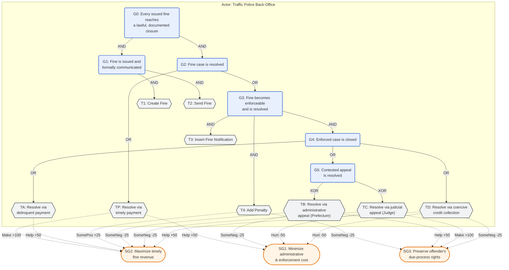

# RTFM Goal Model (Step G) — Road Traffic Fine Management

**Status:** **Frozen**, version 1.0, 2026-08-18 — per `project/OVERVIEW.md`'s definition of Step G,
versioned and frozen before assignment. Frozen by project-owner decision, not by the domain-expert
review originally scoped in §8 below; §8 records that gap so it stays visible rather than
retroactively presented as closed. Any future revision (via Step 9's merge/split/rename loop, or a
domain-expert review) must bump this version, not edit v1.0 in place.
**Target log:** `data/logs/rtfm.xes.gz` — the Road Traffic Fine Management Process event log
(231 variants, 150,370 cases; de Leoni & Mannhardt, 2015).
**Provenance:** Reconstructed from the publicly documented Italian administrative-sanction procedure
for road traffic violations (Legge 689/1981; Codice della Strada, D.Lgs. 285/1992), not transcribed
from a specific municipality's internal process documentation. §8 states what is required to promote
this from "artificial but reasonable" to a genuinely sourced Step G artifact.
**Tool-notation copy:** [`rtfm_goal_model.jucm`](rtfm_goal_model.jucm) — the full model serialized as
jUCMNav's native URN/GRL XMI format: §2's actor, §3–§4's goals/tasks and AND/OR/XOR decomposition
links, §5's softgoals and contribution links, and §6's three indicators (as `grl.ecore`'s
`kpimodel:Indicator`, each carrying its worst/threshold/target as a `KPIEvalValueSet` inside an
`EvaluationStrategy`, grouped under two `IndicatorGroup`s — "Time" for the two duration KPIs,
"Quality" for the payment-share KPI). It was generated against the actual `grl.ecore`/`urncore.ecore`/
`urn.ecore` metamodel definitions fetched from `JUCMNAV/jUCMNavPlus` (not guessed from memory), and
checked for XML well-formedness and referential integrity of every ID — but not round-trip verified by
opening it in jUCMNav itself, since that requires the Eclipse RCP tool, which is not available in this
environment. Please sanity-check it opens correctly and report back if not.
Two things the `.jucm` deliberately does **not** add beyond what this document states: no
`KPIInformationElement`/`KPIModelLink` data-source graph behind each indicator (§6's "Formula" column
is documentary text, not a computable link, so encoding one would assert a relationship this document
doesn't make), and no correlation/contribution link from an indicator to a softgoal (§6's table doesn't
state one). Each indicator's `qualitativeEvaluationValue` is set to "Not measured (Step G draft)" —
deliberately no numeric `evaluationValue`, since no measurement has actually been taken (see §8).

---

## 1. Purpose and scope

This model declares what the fine-management process is *for*, independently of the log, so that its
OR-decomposition can serve as the taxonomy axis for intent-guided variant categorization (Step 5a).
It covers the lifecycle of a single road traffic fine from issuance to closure, as administered by a
local police back-office (*Polizia Locale*) under Italian law. It does not model control flow, timing,
or exceptions beyond what a goal-task decomposition requires — that is the job of the per-category
process model discovered downstream (Step 7), not of this artifact.

## 2. Actors

| Actor | Role | Type |
|---|---|---|
| Traffic Police Back-Office (*Polizia Locale*) | Issues, communicates, enforces, and closes fine cases | Primary |
| Offender | Recipient of the fine; selects among the available resolution paths | External |
| Prefecture (*Prefetto*) | Adjudicates administrative appeals (Art. 203, L. 689/1981) | External |
| Judge (*Giudice di Pace*) | Adjudicates judicial appeals (Art. 204-bis, L. 689/1981) | External |
| Credit Collection Agent | Executes coercive recovery of unpaid, unresolved fines | External |

Only the Traffic Police Back-Office owns goals in this model; the other four are external actors it
depends on for case resolution, not goal-bearing participants.

## 3. Goal–task decomposition



**Reading the decomposition.** G0 requires both formal communication (G1) and resolution (G2) — no
case is closed merely because it was resolved without ever being properly sent. G2 is OR, not XOR: a
case that pays before enforcement (TP) satisfies G2 directly, but the *majority* of cases enter the
enforced branch G3, whose closure (G4) is itself OR because an enforced case's history can combine
tasks (e.g., an appeal that is ultimately followed by payment) rather than select exactly one. The one
place XOR is legally correct, not just convenient, is G5: by statute, the administrative appeal
(Prefecture) and the judicial appeal (Judge) channels are mutually exclusive remedies for the *same*
violation — electing one forecloses the other (*alternatività dei rimedi*, L. 689/1981).

## 4. Decomposition table

| ID | Type | Label | Operator | Children |
|---|---|---|---|---|
| G0 | Goal | Every issued fine reaches a lawful, documented closure | AND | G1, G2 |
| G1 | Goal | Fine is issued and formally communicated | AND | T1, T2 |
| G2 | Goal | Fine case is resolved | OR | TP, G3 |
| G3 | Goal | Fine becomes enforceable and is resolved | AND | T3, T4, G4 |
| G4 | Goal | Enforced case is closed | OR | TA, G5, TD |
| G5 | Goal | Contested appeal is resolved | XOR | TB, TC |
| T1 | Task | Create Fine | leaf | — |
| T2 | Task | Send Fine | leaf | — |
| T3 | Task | Insert Fine Notification | leaf | — |
| T4 | Task | Add Penalty | leaf | — |
| TP | Task | Resolve via timely payment | leaf, repeatable (installments) | — |
| TA | Task | Resolve via delinquent payment | leaf, repeatable (installments) | — |
| TB | Task | Resolve via administrative appeal to the Prefecture | AND (internal steps) | file appeal, transmit to Prefecture, receive ruling, notify offender |
| TC | Task | Resolve via judicial appeal to the Judge | leaf | — |
| TD | Task | Resolve via coercive credit collection | leaf | — |

TP and TA are declared as two distinct tasks despite both ultimately being "payment," because their
business meaning differs by *when* they occur relative to enforcement (T3/T4): a case satisfying TP
never needed formal notification or a penalty surcharge; a case satisfying TA did. This is a
deliberate example of the taxonomy axis carving on business intent rather than on activity-label
identity — the distinction a purely lexical grouping of the log would miss.

## 5. Contribution links (softgoals)

| Source | Target | Value | Rationale |
|---|---|---|---|
| TP | SG2 (timely revenue) | Make (+100) | Fastest possible recovery, no enforcement delay |
| TP | SG1 (low cost) | Help (+50) | No formal notification, penalty computation, or third-party involvement |
| TA | SG2 (timely revenue) | Help (+50) | Recovers revenue, but later than TP |
| T4 (Add Penalty) | SG2 (timely revenue) | SomePositive (+25) | Surcharge increases eventual recovered amount |
| T4 (Add Penalty) | SG3 (due process) | SomeNegative (-25) | Added financial burden on the offender |
| TB (Prefecture appeal) | SG3 (due process) | Help (+50) | Preserves the offender's right to administrative review |
| TB (Prefecture appeal) | SG1 (low cost) | SomeNegative (-25) | Adjudication overhead for the back-office |
| TB (Prefecture appeal) | SG2 (timely revenue) | SomeNegative (-25) | Suspends/delays recovery pending ruling |
| TC (Judicial appeal) | SG3 (due process) | Make (+100) | Strongest guarantee — independent judicial review |
| TC (Judicial appeal) | SG1 (low cost) | Hurt (-50) | Court fees and case-management overhead |
| TC (Judicial appeal) | SG2 (timely revenue) | SomeNegative (-25) | Suspends/delays recovery pending ruling |
| TD (Credit collection) | SG2 (timely revenue) | Help (+50) | Eventually recovers revenue from non-payers |
| TD (Credit collection) | SG1 (low cost) | Hurt (-50) | Collection-agent fees and enforcement overhead |
| TD (Credit collection) | SG3 (due process) | SomeNegative (-25) | Coercive path, least offender agency in the outcome |

Qualitative scale follows the GRL/URN standard (Make = 100, Help = 50, SomePositive = 25, Unknown = 0,
SomeNegative = -25, Hurt = -50, Break = -100), as used in the IMS example (Amyot et al., 2022).

## 6. Indicators

| KPI | Formula (informal) | Worst | Threshold | Target | Provenance |
|---|---|---|---|---|---|
| Time to formal notification | days, Create Fine → Insert Fine Notification | > 360 | 90 | ≤ 90 | Statutory — Art. 201, D.Lgs. 285/1992, ordinary notification term for domestic-plate violations; extended terms (illustratively, up to 360 days) apply to cases requiring foreign/complex ownership lookup |
| Share of cases closed by voluntary payment (TP + TA) | % of closed cases | < 40% | 40% | ≥ 65% | Illustrative managerial target — no external source; a real Step G artifact should replace this with the owning municipality's actual target |
| Average time to case closure | days, Create Fine → last resolving task | > 365 | 180 | ≤ 180 | Illustrative managerial target — no external source |

Only the first indicator is statute-grounded; the other two are invented for this illustrative draft
and are flagged as such rather than presented with false precision. Exact statutory day-counts have
been amended over time and should be checked against the consolidated text before this model is used
for anything beyond illustration.

## 7. Traceability to observed RTFM activity labels (non-binding)

This table exists only to make the model legible against the actual log vocabulary; it is not part of
the goal model's authority and must not be used to pre-filter or pre-match narratives lexically — per
`project/OVERVIEW.md`, Step 6 matching is semantic ("does this narrative realize this declared
alternative?"), not a string match against this table.

| Task | Typically realized by (RTFM activity labels) |
|---|---|
| T1 | `Create Fine` |
| T2 | `Send Fine` |
| T3 | `Insert Fine Notification` |
| T4 | `Add penalty` |
| TP / TA | `Payment` (one or more occurrences) |
| TB | `Insert Date Appeal to Prefecture`, `Send Appeal to Prefecture`, `Receive Result Appeal from Prefecture`, `Notify Result Appeal to Offender` |
| TC | `Appeal to Judge` |
| TD | `Send for Credit Collection` |

Two known behaviors deliberately fall outside this table, by design rather than by omission:

- **Right-censored (open) cases** — e.g., variants ending at `Create Fine > Send Fine` with no
  resolving task — represent cases still pending when the log was extracted, not a violation of G0;
  they should be treated as *not yet satisfied*, not as anomalies.
- **Non-canonical orderings** — e.g., a `Payment` recorded before `Send Fine` (plausible as an
  in-person roadside payment logged out of the mailed-notice sequence) — are exactly the kind of
  unanticipated behavior this architecture is built to surface as residual evidence for revising the
  goal model, not something this draft should be widened to absorb pre-emptively.

## 8. Limitations of the frozen artifact

This model is authored from general, publicly available statutory sources, not from Polizia Locale
internal procedure documents, and its two illustrative KPIs (§6) have no external grounding at all.
Both gaps mirror the bottleneck the goal-oriented process mining literature itself reports — "logs
typically do not include explicit goals, KPIs, or goal models" (Ghasemi et al., 2025). That literature
closes the equivalent gap through **domain-expert review**: Ghasemi et al. (2025, Ch. 8) grounded
their Sepsis KPI triples in physician consultation against the actual clinical guideline. That review
has **not** happened for this artifact — v1.0 was frozen by project-owner decision on 2026-08-18 for
pipeline-development purposes, not through consultation with a Polizia Locale administrative officer
or legal counsel. §3–§5 (the goal-task decomposition that Step 5a actually consumes) rest on cited
statutory sources (L. 689/1981; D.Lgs. 285/1992) and are not affected by this gap; §6's two
non-statutory KPIs remain invented placeholders and should be read as such wherever they appear
downstream. A future domain-expert pass, should one occur, supersedes v1.0 as a new frozen version,
not an edit to it.

## 9. References

```bibtex
@misc{deleoni2015rtfm,
  author       = {de Leoni, Massimiliano and Mannhardt, Felix},
  title        = {Road Traffic Fine Management Process},
  year         = {2015},
  publisher    = {4TU.ResearchData},
  doi          = {10.4121/uuid:270fd440-1057-4fb9-89a9-b699b47990f5}
}

@article{mannhardt2016balanced,
  author  = {Mannhardt, Felix and de Leoni, Massimiliano and Reijers, Hajo A. and van der Aalst, Wil M. P.},
  title   = {Balanced multi-perspective checking of process conformance},
  journal = {Computing},
  volume  = {98},
  number  = {4},
  pages   = {407--437},
  year    = {2016},
  doi     = {10.1007/s00607-015-0441-1}
}

@misc{legge689_1981,
  author       = {{Repubblica Italiana}},
  title        = {Legge 24 novembre 1981, n. 689 --- Modifiche al sistema penale (artt. 203, 204-bis: opposizione al Prefetto e ricorso al Giudice di Pace)},
  year         = {1981},
  howpublished = {Gazzetta Ufficiale}
}

@misc{cds1992,
  author       = {{Repubblica Italiana}},
  title        = {Decreto Legislativo 30 aprile 1992, n. 285 --- Nuovo Codice della Strada (artt. 201--203: notificazione e pagamento delle violazioni)},
  year         = {1992},
  howpublished = {Gazzetta Ufficiale}
}

@inproceedings{ghasemi2025goped,
  author    = {Ghasemi, Mahdi and Amyot, Daniel and Van Woensel, William},
  title     = {Goal-oriented Process Mining: A Scalability Experiment},
  booktitle = {MoDRE Workshop @ IEEE 33rd International Requirements Engineering Conference Workshops (REW)},
  pages     = {304--313},
  year      = {2025},
  doi       = {10.1109/REW66121.2025.00046}
}

@article{amyot2022urnsurvey,
  author  = {Amyot, Daniel and Akhigbe, Okhaide and Baslyman, Malak and Ghanavati, Sepideh and Ghasemi, Mahdi and Hassine, Jameleddine and Lessard, Lysanne and Mussbacher, Gunter and Shen, Kairui and Yu, Eric},
  title   = {Combining Goal Modelling with Business Process Modelling: Two Decades of Experience with the User Requirements Notation Standard},
  journal = {Enterprise Modelling and Information Systems Architectures (EMISAJ)},
  volume  = {17},
  number  = {2},
  pages   = {2:1--2:38},
  year    = {2022},
  doi     = {10.18417/emisa.17.2}
}
```
