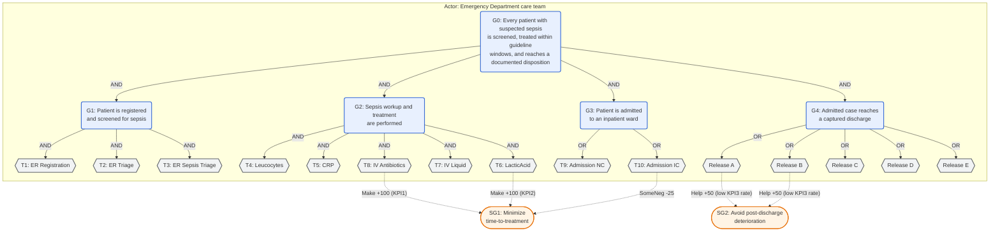

# Sepsis Goal Model — Emergency-Department Sepsis Pathway

**Target log:** `data/logs/sepsis.xes.gz` — the Sepsis Cases event log (Mannhardt, 2016): 1,050 traces
· 846 unique variants · 15,214 events · 16 activities (counts verified against the file's embedded XES
metadata and a direct scan). Ghasemi (2021, Ch. 8, p. 147) reports 846 unique traces (matches) but
15,124 events from a raw CSV export — a 0.6% discrepancy, plausibly a preprocessing difference, not
investigated here.

**Tool-notation copy:** [`sepsis_goal_model.jucm`](sepsis_goal_model.jucm) — the model in jUCMNav's
URN/GRL XMI format: the actor, the goal/task decomposition, the softgoal contribution links, and §6's
three indicators (each a `grl.kpimodel:Indicator` with a `KPIEvalValueSet` conversion, a `goalcat:*`
measurement binding, and a contribution link to a softgoal, grouped under the `Time-to-treatment` and
`Outcome` `IndicatorGroup`s). Checked for XML well-formedness and referential integrity; not round-trip
verified in jUCMNav (Eclipse RCP unavailable here).

**What is grounded, and what is not.** The most load-bearing content — §6's three KPIs — is reused,
with attribution, from Ghasemi (2021, Ch. 8), who derived them for this exact log from guideline
windows in Mannhardt & Blinde (2017) — the log's own co-author's process-mining study — and refined
them "after consultation with a physician" (Ghasemi, 2021, Acknowledgments; §8.4). Mannhardt & Blinde
(2017, §2), citing Rhodes et al. (2017), trace those windows to the Surviving Sepsis Campaign's 2016
international guideline. What is *not* reused from any source is the AND/OR goal-task decomposition
(§3–§4): no source builds a task-alternative taxonomy for this log — Ghasemi's own goal model (2021,
Fig. 37) is a flat set of three KPI-linked goals. The decomposition, the actor structure (§2), and the
softgoal contribution values (§5) are this project's construction, built to give Step 5a the
OR-decomposition it needs; no physician has reviewed them (§8).

---

## 1. Purpose and scope

This model declares what the emergency-department sepsis pathway is *for*, independently of the log, so
its OR-decomposition can serve as the taxonomy axis for intent-guided variant categorization (Step 5a).
It covers a patient's trajectory from emergency-room registration, through sepsis screening and
guideline-timed treatment, to ward admission and eventual discharge, as recorded by a Dutch hospital's
information system (Mannhardt & Blinde, 2017, §2). It does not model control flow, timing, or exceptions
beyond what a goal-task decomposition requires.

## 2. Actors

| Actor | Role | Type |
|---|---|---|
| Emergency Department (ED) care team | Registers, triages, tests, treats, and dispositions the patient | Primary |
| Patient | Presents with suspected sepsis; may return to the ED after discharge | External |
| Inpatient ward (Normal Care / Intensive Care) | Receives the patient if admitted; the ward stay itself is outside the log's scope | External |

Only the ED care team owns goals; the other two are external actors it depends on or acts upon.

## 3. Goal–task decomposition



G0 requires screening (G1), treatment (G2), *and* a documented disposition (G3 admission, then G4
discharge). G3 is OR, not XOR: exactly one of Normal Care or Intensive Care admission is expected per
episode, a genuine severity-driven alternative. G4 is OR across five discharge dispositions (Release
A–E). G1 and G2 are AND: registration, triage, and sepsis-specific triage are each required, and
diagnostic workup (T4–T6) plus treatment (T7–T8) are jointly expected within the treatment window.

## 4. Decomposition table

| ID | Type | Label | Operator | Children |
|---|---|---|---|---|
| G0 | Goal | Every patient with suspected sepsis is screened, treated within guideline windows, and reaches a documented disposition | AND | G1, G2, G3, G4 |
| G1 | Goal | Patient is registered and screened for sepsis | AND | T1, T2, T3 |
| G2 | Goal | Sepsis workup and treatment are performed | AND | T4, T5, T6, T7, T8 |
| G3 | Goal | Patient is admitted to an inpatient ward | OR | T9, T10 |
| G4 | Goal | Admitted case reaches a captured discharge | OR | Release A, Release B, Release C, Release D, Release E |
| T1 | Task | ER Registration | leaf | — |
| T2 | Task | ER Triage | leaf | — |
| T3 | Task | ER Sepsis Triage | leaf | — |
| T4 | Task | Leucocytes (blood test) | leaf | — |
| T5 | Task | CRP (blood test) | leaf | — |
| T6 | Task | LacticAcid (blood test) | leaf, guideline-timed (KPI2) | — |
| T7 | Task | IV Liquid | leaf | — |
| T8 | Task | IV Antibiotics | leaf, guideline-timed (KPI1) | — |
| T9 | Task | Admission NC (Normal Care) | leaf | — |
| T10 | Task | Admission IC (Intensive Care) | leaf | — |
| Release A–E | Task | Five distinct discharge dispositions | leaf | — |

G3 → G4 is empirically sequential in this log: every trace containing a Release also contains a prior
Admission (782 of 1,050 traces, 74.5%); zero traces reach a Release with no prior Admission (direct
scan). No "direct release without ward admission" alternative is declared.

The five Release labels (A–E) are carried unchanged from the dataset's own activity names. Neither
Ghasemi (2021), Mannhardt & Blinde (2017), nor the 4TU.ResearchData listing decodes what clinically
distinguishes them beyond frequency (Release A is 63.9% of cases per Ghasemi 2021, Table 17; Release E
the rarest at 0.6%). They are declared as five alternative closure tasks because the log treats them as
five distinct labels; a domain-expert pass should confirm or collapse this split.

## 5. Contribution links (softgoals)

| Source | Target | Value | Rationale |
|---|---|---|---|
| T8 (IV Antibiotics) | SG1 (time-to-treatment) | Make (+100) | Directly satisfies the guideline's 1-hour antibiotic window (KPI1) |
| T6 (LacticAcid) | SG1 (time-to-treatment) | Make (+100) | Directly satisfies the guideline's 3-hour lactate window (KPI2) |
| T10 (Admission IC) | SG1 (time-to-treatment) | SomeNegative (-25) | Intensive Care admission is associated with more severe, harder-to-treat-within-window presentations |
| Release A | SG2 (avoid post-discharge deterioration) | Help (+50) | The modal discharge outcome; no claim beyond frequency (see §4) |
| Release B | SG2 (avoid post-discharge deterioration) | Help (+50) | Second most frequent discharge outcome; no claim beyond frequency (see §4) |

This table is thin and illustrative by choice: no source assigns contribution weights for this log's
discharge dispositions, so the missing three rows (Release C/D/E) are omitted rather than invented. A
domain-expert pass is the right place to complete it.

## 6. Indicators

Three indicators in two groups (`Time-to-treatment` for KPI1/KPI2, `Outcome` for KPI3). Each carries a
`KPIEvalValueSet` (the measurement → satisfaction conversion), a `goalcat:*` measurement binding
(§6.1), and a contribution link to a softgoal (§6.2).

| KPI | Formula (informal) | Worst | Threshold | Target | Provenance |
|---|---|---|---|---|---|
| KPI1 — Time to antibiotics | hours, `ER Sepsis Triage` → first `IV Antibiotics` | 3 h | 1.8 h | ≤ 1 h | **`guideline`**: Rhodes et al. (2017), Surviving Sepsis Campaign 2016, cited by Mannhardt & Blinde (2017, §2) for the 1-hour antibiotic rule for this log; worst/threshold/target reused verbatim from Ghasemi (2021, Ch. 8, Table 19), physician-consulted |
| KPI2 — Time to lactate measurement | hours, `ER Sepsis Triage` → first `LacticAcid` | 7 h | 5 h | ≤ 3 h | **`guideline`**: same chain — Rhodes et al. (2017) via Mannhardt & Blinde (2017, §2) for the 3-hour lactate rule; values reused verbatim from Ghasemi (2021, Ch. 8, Table 19) |
| KPI3 — Post-discharge ER return | fraction of cases with `Return ER` present anywhere in the trace | 1 (returned) | — | 0 (no return) | **`illustrative`**: reused from Ghasemi (2021, Ch. 8) as "a common goal of any healthcare system", not a cited guideline window; the source defines no threshold |

KPI1 and KPI2 are the most reliably grounded indicators in this project — reused, not re-derived, with
their physician-consulted values carried forward with attribution. The `guideline` provenance class
(`goalcat.grl.measures.PROVENANCE_CLASSES`) sits below `statutory` but above `external-by-analogy`: a
published clinical standard applied to the process it was written for. KPI3 keeps the weakest class,
`illustrative`, matching how the source frames it.

### 6.1 Measurement bindings

The binding is supplied as URN `Metadata` under a `goalcat:` prefix, so it travels inside the `.jucm`
file and survives a jUCMNav round trip. `goalcat.grl.measures` documents the key set; `goalcat.indicators`
(Step 7b) consumes it.

| Indicator | `goalcat:measure` | `goalcat:from` | `goalcat:to` | `goalcat:aggregate` |
|---|---|---|---|---|
| KPI1 | `duration_hours` | `ER Sepsis Triage` | `IV Antibiotics` (first) | `mean` |
| KPI2 | `duration_hours` | `ER Sepsis Triage` | `LacticAcid` (first) | `mean` |
| KPI3 | `trace_contains` | — | `Return ER` | `mean` (→ the rate) |

- **`duration_hours`** — identical to `duration_days` but reported in hours, since the Surviving Sepsis
  Campaign windows are hour-scale. Same clock semantics: start at the first `ER Sepsis Triage`, stop at
  the first `to` event at or after it.
- **`trace_contains`** — a binary per-case measure with no clock: 1 if `Return ER` appears anywhere in
  the case, 0 otherwise. A `mean` aggregate over a sublog is then that label's rate of occurrence,
  which KPI3's `worst = 1` / `target = 0` value set converts.

KPI3 is measured over **every** case (no `goalcat:applies_when`), matching Ghasemi (2021)'s binary
"present in trace" definition and the 28.0% figure in §7. A consequence worth stating: a right-censored
case that never reached a captured discharge (§7) contributes a 0 ("no return"), which the value set
scores as fully satisfied — arguably too generous. A domain-expert pass could scope KPI3 to discharged
cases; this draft keeps the source's definition and flags the effect here.

The activity labels in these bindings are a measurement device, not a matching rule — §7's prohibition
on lexical pre-matching governs Step 6 categorization, which runs before this and never sees them.

### 6.2 Contribution links

An `Indicator` is an `IntentionalElement` and sits in the satisfaction graph, but a converted value
needs a link to propagate. Three links, one per indicator:

| Indicator | → | Softgoal | Contribution | Rationale |
|---|---|---|---|---|
| KPI1 Time to antibiotics | → | SG1 Minimize time-to-treatment | Help (+50) | Antibiotic timeliness against the 1-hour window is the core of time-to-treatment. |
| KPI2 Time to lactate measurement | → | SG1 Minimize time-to-treatment | Help (+50) | Lactate timeliness against the 3-hour window is the other half of the same softgoal. |
| KPI3 Post-discharge ER return | → | SG2 Avoid post-discharge deterioration | Help (+50) | A low return rate is precisely what this softgoal names. |

These weights are authored for this artifact, not sourced — the same illustrative status §5's table
carries. They are distinct from §5's `T8 → SG1` / `T6 → SG1` task links: those say "performing the task
helps"; these say "performing it *within the window*, as the indicator measures, helps".

### 6.3 What the value sets can and cannot discriminate

Measured against the real 1,050-case log (`goalcat.indicators` run, 2026-08-28):

| KPI | Measured (whole log) | Satisfaction | Coverage | Note |
|---|---|---|---|---|
| KPI1 | 1.86 h mean | ≈ 0 | 78% (823 measured, 226 `no_end`, 1 `no_start`) | Sits almost exactly on the 1.8 h threshold; the 226 `no_end` cases were triaged but have no `IV Antibiotics` event. |
| KPI2 | 1.39 h mean | +100 | 70% (739 measured, 310 `no_end`) | Well inside the 3 h target — lactate is drawn early when it is drawn at all. |
| KPI3 | 0.280 rate | −28 | 100% | Matches §7's 28.0% return figure exactly. |

The coverage numbers are the finding, not a defect: KPI1/KPI2 are undefined for a large minority of
cases *because the treatment step never occurred*, and scoring those as bad values would invert the
measurement. `goalcat.indicators` prints the raw measured value, the `no_start`/`no_end` counts, and
the coverage beside every satisfaction score for this reason.

## 7. Traceability to observed activity labels (non-binding)

For legibility against the log vocabulary only — not part of the model's authority, and not to be used
for lexical pre-matching (Step 6 matching is semantic). Because every task in §3–§4 is already named
after its activity label, this table is close to an identity map.

| Task | Sepsis activity label |
|---|---|
| T1–T10 | Identical string (see §4) |
| Release A–E | Identical string (see §4) |

Two behaviors sit outside this table by design: **right-censored (incomplete) cases** — 28 of 1,050
traces (2.7%) reach an Admission but no captured Release, and a further 240 (22.9%) end before either
(direct scan); these are cases still open, transferred, or not captured to closure — *not yet
satisfied*, not anomalies. **`Return ER`** — present in 294 of 1,050 traces (28.0%, Ghasemi 2021,
Table 17) — is not a task in §3–§4; it is the observable behind KPI3, a quality signal about the
*prior* discharge, not a step toward G0.

## 8. Limitations

- §6's KPI1 and KPI2 are the artifact's most consequential content and its best-grounded: reused from
  Ghasemi (2021, Ch. 8), whose worst/threshold/target values were set "after consultation with a
  physician" (Ghasemi 2021, §8.4) for this log, and traceable to the Surviving Sepsis Campaign 2016
  guideline (Rhodes et al., 2017) via Mannhardt & Blinde (2017, §2).
- That physician consultation was scoped to two flat, KPI-linked goals (Ghasemi 2021, Fig. 37) — not to
  §3–§4's AND/OR decomposition, §2's actors, or §5's contribution links, which are this draft's own
  construction.
- §3's G3 (ward-admission OR) and G4 (discharge OR) are grounded only in this log's observed structure
  (the admission-before-release ordering in §4, and the five Release labels the dataset uses), not in
  any clinical-guideline or physician source.
- §4's Release A–E are declared as five distinct tasks because the log treats them as five distinct
  labels; their clinical meaning beyond frequency is not established by any source consulted here.
- §5's softgoal contribution values are illustrative and incomplete by explicit choice (Release C/D/E
  omitted rather than invented).
- KPI3's value set scores a never-discharged case as fully satisfied (§6.1).
- No domain-expert review of this specific decomposition, as distinct from the KPI reuse above, has
  occurred.

## 9. References

```bibtex
@misc{mannhardt2016sepsis,
  author       = {Mannhardt, Felix},
  title        = {Sepsis Cases - Event Log},
  year         = {2016},
  publisher    = {4TU.ResearchData},
  doi          = {10.4121/uuid:915d2bfb-7e84-49ad-a286-dc35f063a460}
}

@inproceedings{mannhardt2017trajectories,
  author       = {Mannhardt, Felix and Blinde, Diana},
  title        = {Analyzing the Trajectories of Patients with Sepsis using Process Mining},
  booktitle    = {RADAR+EMISA Workshop @ CAiSE Forum},
  series       = {CEUR Workshop Proceedings},
  volume       = {1859},
  pages        = {72--80},
  year         = {2017},
  note         = {https://ceur-ws.org/Vol-1859/bpmds-08-paper.pdf}
}

@article{rhodes2017survivingsepsis,
  author       = {Rhodes, Andrew and others},
  title        = {Surviving Sepsis Campaign: International Guidelines for Management of Sepsis and Septic Shock: 2016},
  journal      = {Intensive Care Medicine},
  volume       = {43},
  number       = {3},
  pages        = {304--377},
  year         = {2017},
  doi          = {10.1007/s00134-017-4683-6}
}

@phdthesis{ghasemi2021dissertation,
  author       = {Ghasemi, Mahdi},
  title        = {Goal-oriented Process Mining},
  school       = {University of Ottawa},
  year         = {2021},
  doi          = {10.20381/ruor-27301}
}
```
